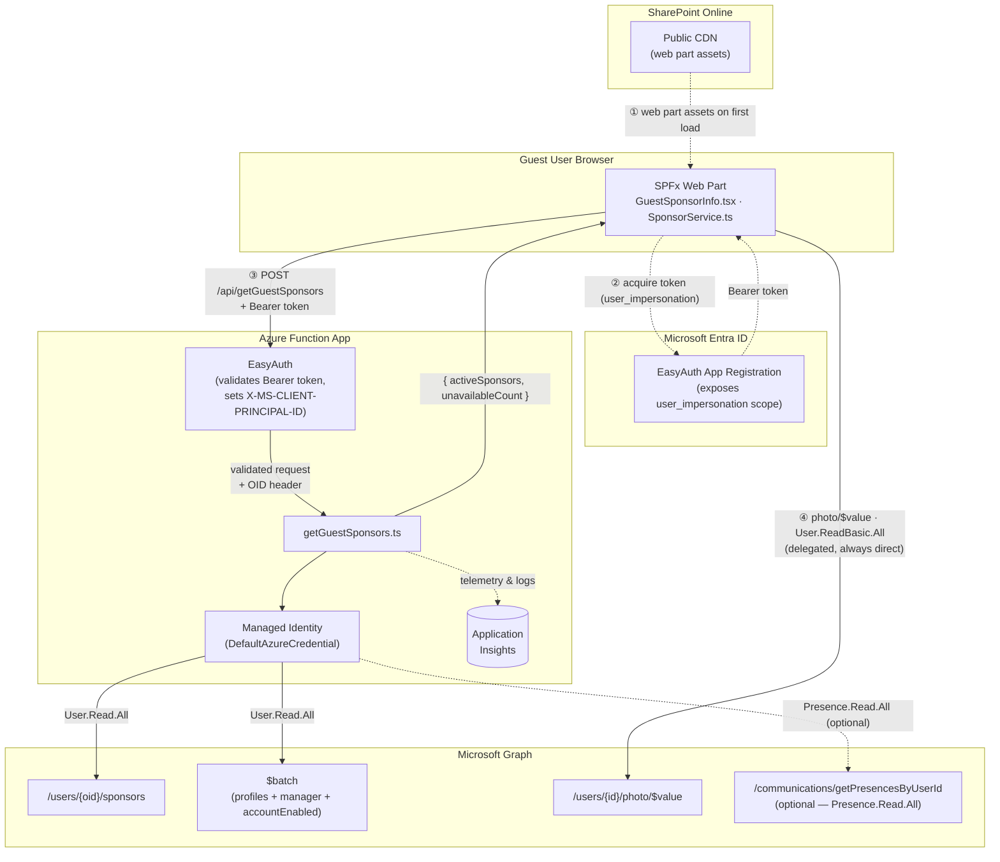
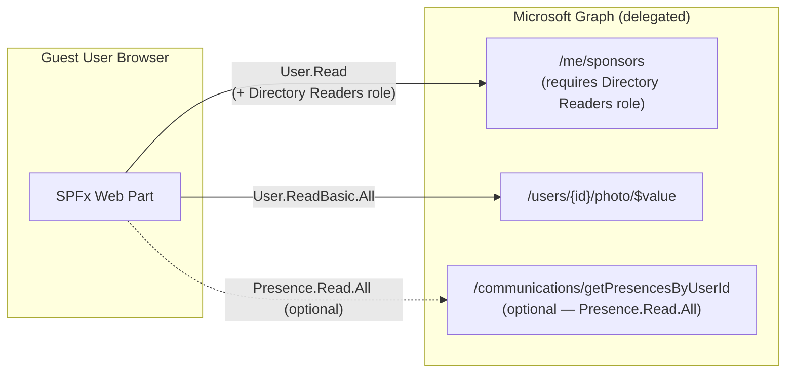

# Architecture Diagram

Visual system-level overview of the *Guest Sponsor Info* solution.
For the written design decisions behind each component, see [architecture.md](architecture.md).

---

## Recommended Path — Azure Function Proxy

The function proxy is the **recommended deployment**: guests never need an Entra
directory role, and all Graph app-permission calls are confined to the function.

### Step-by-step

| Step | What happens |
|---|---|
| ① | Browser loads the bundled web part JavaScript from the SharePoint Public CDN. |
| ② | Web part acquires an Entra ID token for the EasyAuth App Registration (`user_impersonation` scope). No extra guest consent needed — the scope is pre-authorized for *SharePoint Online Web Client Extensibility*. |
| ③ | Web part calls `POST /api/getGuestSponsors` on the Function App, passing the Bearer token. EasyAuth validates the token before any function code runs and injects the caller's object ID as `X-MS-CLIENT-PRINCIPAL-ID`. The function never trusts a user ID from the request body. |
| ④ | Profile photos are always fetched **directly** from Graph with a delegated token (`User.ReadBasic.All`). They are returned as `ArrayBuffer` → base64 data URL to avoid `Blob` URL leaks. |

The function uses `Promise.allSettled` to fan out three Graph calls concurrently
(sponsor list, `$batch` for profiles + manager, optional presence) and returns
`{ activeSponsors, unavailableCount }` once all resolve.

---

## Fallback Path — Direct Graph (legacy)

When **no Azure Function URL is configured**, the web part falls back to calling
`GET /me/sponsors` directly on Microsoft Graph with a delegated token. This
requires the guest account to hold an Entra directory role (e.g. *Directory Readers*),
which is impractical at scale. Deploy the Azure Function to avoid this.

> **Note:** On the direct path, `accountEnabled` cannot be checked efficiently
> because `User.Read.All` is not requested. Disabled-but-not-deleted sponsors
> remain visible until their account is hard-deleted from Entra ID.

---

## Component Summary

| Component | Technology | Role |
|---|---|---|
| SPFx Web Part | React 17 · Fluent UI v8 · TypeScript | Guest-facing UI inside SharePoint |
| Azure Function | Node.js 22 · Azure Functions v4 | Graph proxy — enforces caller identity, applies business filters |
| EasyAuth | Azure App Service Authentication | Validates JWT Bearer tokens before function code runs |
| Managed Identity | Azure system-assigned MI | Credential-free Graph access (`DefaultAzureCredential`) |
| Microsoft Graph | REST API | Source of sponsors, profiles, photos, and presence |
| Application Insights | Azure Monitor | Function telemetry, structured error logs |

---

## Related Documents

- [architecture.md](architecture.md) — design decisions, known limitations, SPFx lifecycle
- [deployment.md](deployment.md) — step-by-step deployment, Azure Function setup, hosting plans
- [development.md](development.md) — local dev setup, build & test commands
- [features.md](features.md) — feature descriptions and the problems they solve
- [README](../README.md) — quick-start and overview
- [Azure Function README](../azure-function/README.md) — function-specific permissions and security design
